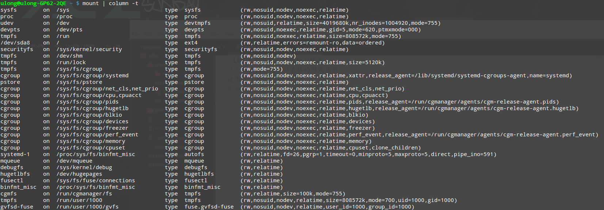
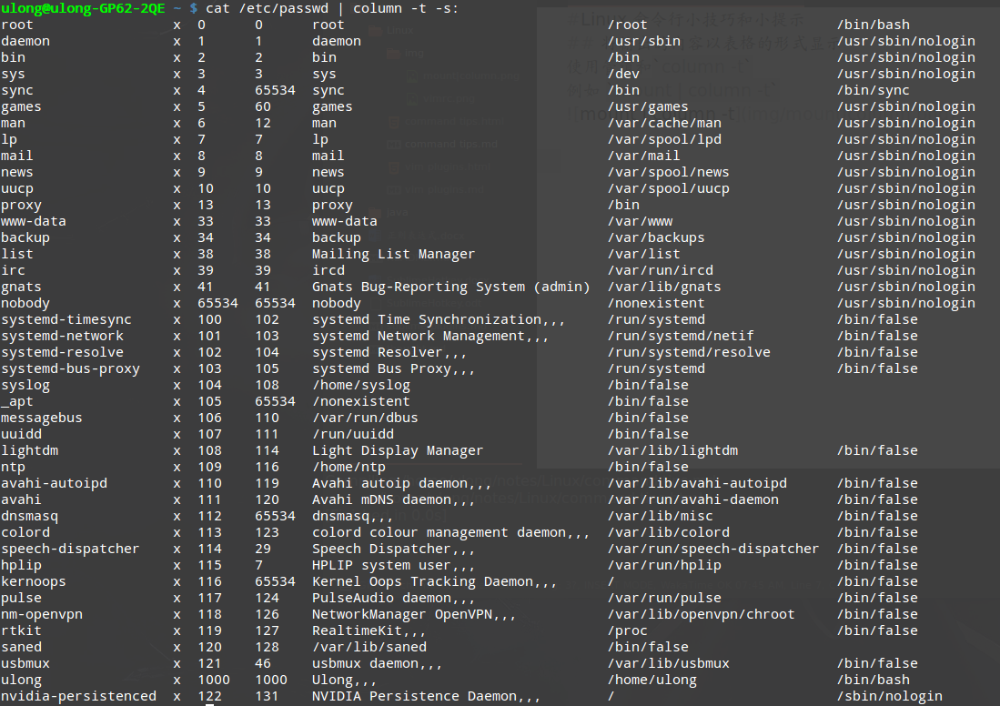
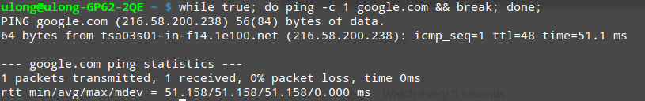
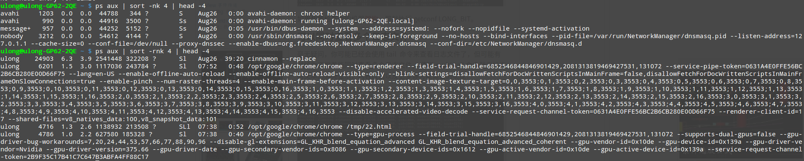
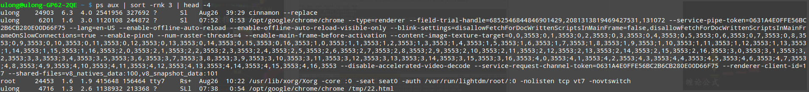
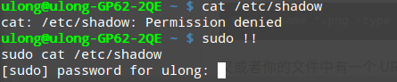

#Linux 命令行小技巧和小提示
## 将输出的内容以表格的形式显示
使用管道和`column -t`
例如 `mount | column -t`


使用`-s`可以指定分隔符
例如`cat /etc/passwd | column -t -s:`


##重复执行一个命令，直到它运行成功
不少人关心如何实现重复执行命令，直到它成功返回并运行正常
可以使用`while true`循环实现：


一劳永逸的做法：
定义 `repeat()`函数：
```
repeat()
{
    while true
    do
        $@ && return
    done
}
```
或者把它放入shell的rc文件，更便于使用：
`repeat() {while true; do $@ && return; done}`

更快的做法：
在大多数现代系统中，true是作为/bin中的一个二进制文件来实现的。这就意味着每执行一次while循环，
shell就不得不生成一个进程。如果不想这样，可以使用shell內建的`：`命令，他总是返回为0的退出码：
`repeat() {while :; do $@ && return; done}`
增加延时：
`repeat() {while :; do $@ && return; sleep 30; done}`

##按内存使用量对进程进行排序
`ps aux | sort -nk 4`:


##按cpu使用量对进程排序
`ps aux | sort -rnk 3`:


##同时查看多个日志文件
`multitail`支持文本高亮，内容过滤等，需要安装

##回到上一次操作的目录
`cd -`

##让非交互式shell会话可进行交互
(没太明白-_-)
把设置从~/.bashrc改成~/.bash_profile

##定时的监控性命令输出
使用watch命令(`watch df -h`)，你就可以查看到任何命令的任何输出。
例如你可以查看可用空间以及它的使用量增长情况。

`watch -n 5 ls -l`

##自动的对任何命令回答Yes或No
自动化需要用户说yes的过程，可以使用yes命令实现：
`yes | apt update`

自动说 No，使用`yes no|`

##创建具有指定大小的文件
可以使用`dd`命令来创建出具有指定大小的文件：
`dd if=/dev/zero of=out.txt bs=1M count=10`

这样就会创建出一个10MB的文件，填充零作为内容

##以root用户运行上一个命令
有时，会忘记在需要root权限的命令前敲入sudo。这时候不需要重写命令，只需要输入
`sudo !!`即可：


##对命令行会话进行记录
如果想要把自己在shell屏幕上敲得命令记录下来，可以使用script命令将所有敲写的内容
保存到一个名为typescript的文件中去。

等你敲入`exit`命令以后，所有的命令都会被写如该文件，一遍事后查看。

##用tab替换空格
可以使用tr命令替换任何字符，这个用起来非常方便：
`cat geeks.txt | tr ':[space]:' '\t' > out.txt`

##将文件内容转换为大写或者小写
`cat geeks.txt | tr a-z A-Z > output.txt`

##强大的Xargs命令
xargs命令是最重要的Linux命令技巧之一。你可以使用这个命令将命令的输出作为参数传递给
另一个命令。例如，搜索png文件然后对其进行压缩或者其他操作：
`find . -name '*.png' -type f -print | xargs tar -cvzf images.tar.gz`

    ps: 注意多文件查找时的单引号，不加单引号`*`会被展开为当前目录下的所有文件，匹配会出错,
    也可以使用反斜杠转义

又或者你的文件中有一个URL列表，而你想做的是以不同的方式下载或者处理这些URL，你可以
这样做：
`cat urls.txt | xargs wget`

第一个命令的输出会在 xargs 命令结尾处传递。

那如果命令需要中间过程的输出，该怎么办呢？这个简单！

只需要使用 {} 并结合 -i 参数就行了。如下所示，替换在第一个命令的输出应该去的地方的参数：
`ls /etc/*.conf | xargs -i cp {} ~/out/`

这只是 Linux 命令行技巧其中的几个而已。你可以使用其他命令来做一些更 HAPPY 的事情，
比如 awk 命令和 sed 命令！


[<button style="position: fixed; bottom: 50px;right: 50px;height:35px;width:50px;font-size:16px;">TOP</button>](#top)

