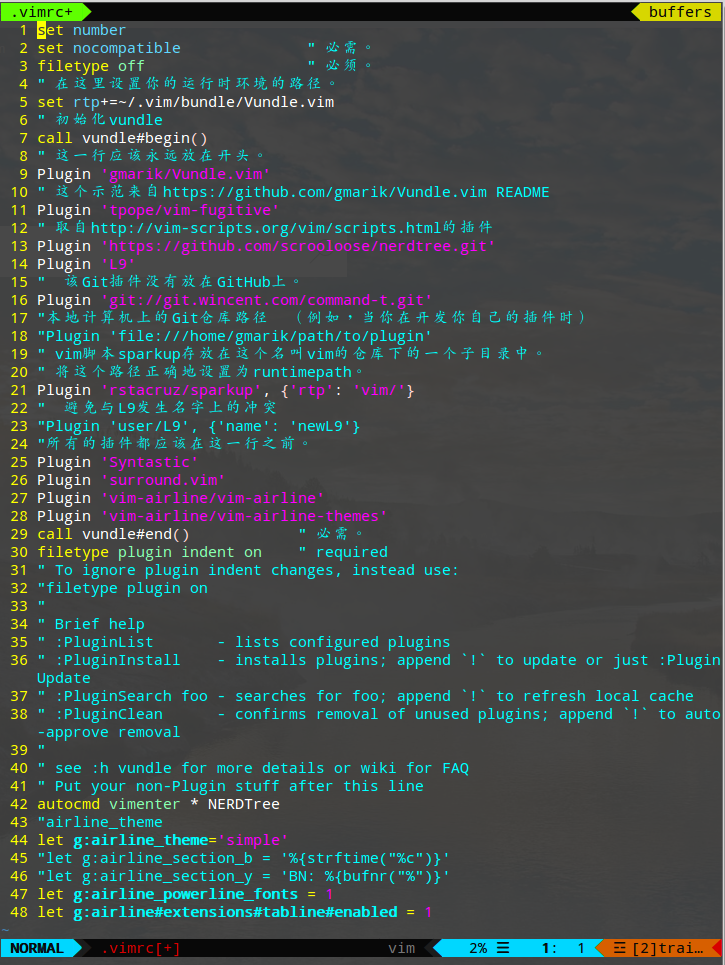

# vim 插件篇
## 准备条件
1. 先安装vim（废话）
2. 安装git（许多插件可以直接git下载手动安装）
## 安装Vundle
1. 创建一个目录，Vim的插件将会被下载并且安装在这个目录上。默认情况下，这个目录为~/.vim/bundle。
`$ mkdir -p ~/.vim/vundle`
2. 使用如下指令安装Vundle。Vundle本身也是一个vim插件。因此我们同样把vundle安装到之前创建的目录~/.vim/bundle下
`$ git clone https://github.com/VundleVim/Vundle.vim.git ~/.vim/bundle/Vundle.vim`
## 配置Vundle

```vim
set number
set nocompatible              " 必需。 
filetype off                  " 必须。
" 在这里设置你的运行时环境的路径。
set rtp+=~/.vim/bundle/Vundle.vim
" 初始化vundle
call vundle#begin()
" 这一行应该永远放在开头。
Plugin 'gmarik/Vundle.vim'
" 这个示范来自https://github.com/gmarik/Vundle.vim README
Plugin 'tpope/vim-fugitive'
" 取自http://vim-scripts.org/vim/scripts.html的插件
Plugin 'https://github.com/scrooloose/nerdtree.git'
Plugin 'L9'
"　该Git插件没有放在GitHub上。
Plugin 'git://git.wincent.com/command-t.git'
"本地计算机上的Git仓库路径　（例如，当你在开发你自己的插件时）
"Plugin 'file:///home/gmarik/path/to/plugin'
" vim脚本sparkup存放在这个名叫vim的仓库下的一个子目录中。
" 将这个路径正确地设置为runtimepath。
Plugin 'rstacruz/sparkup', {'rtp': 'vim/'}
"　避免与L9发生名字上的冲突
"Plugin 'user/L9', {'name': 'newL9'}
"所有的插件都应该在这一行之前。
Plugin 'Syntastic'
Plugin 'surround.vim'
Plugin 'vim-airline/vim-airline'
Plugin 'vim-airline/vim-airline-themes'
call vundle#end()            " 必需。
filetype plugin indent on    " required
" To ignore plugin indent changes, instead use:
"filetype plugin on
"
" Brief help
" :PluginList       - lists configured plugins
" :PluginInstall    - installs plugins; append `!` to update or just :PluginUpdate
" :PluginSearch foo - searches for foo; append `!` to refresh local cache
" :PluginClean      - confirms removal of unused plugins; append `!` to auto-approve removal
"
" see :h vundle for more details or wiki for FAQ
" Put your non-Plugin stuff after this line
autocmd vimenter * NERDTree
"airline_theme
let g:airline_theme='simple'
"let g:airline_section_b = '%{strftime("%c")}'
"let g:airline_section_y = 'BN: %{bufnr("%")}'
let g:airline_powerline_fonts = 1 
let g:airline#extensions#tabline#enabled = 1 
```
简单解释一下上面的设置：默认情况下，Vundle将从github.com或者vim-scripts.org下载和安装vim插件。你也可以改变这个默认行为。

要从github安装插件:
`$ Plugin 'user/plugin'`

要从 http://vim-scripts.org/vim/scripts.html 处安装:
`$ Plugin 'plugin_name'`

要从另外一个git仓库中安装:
`$ Plugin 'git://git.another_repo.com/plugin'`

从本地文件中安装：
`$ Plugin 'file:///home/user/path/to/plugin'`

你同样可以定制其它东西，例如你的插件的运行时路径，当你自己在编写一个插件时，或者你只是想从其它目录——而不是~/.vim——中加载插件时，这样做就非常有用。
`$ Plugin 'rstacruz/sparkup', {'rtp': 'another_vim_path/'}`

如果你有同名的插件，你可以重命名你的插件，这样它们就不会发生冲突了。
`$ Plugin 'user/plugin', {'name': 'newPlugin'}`

## Vundle使用
:PluginList       - lists configured plugins
:PluginInstall    - installs plugins; append `!` to update or just :PluginUpdate
:PluginSearch foo - searches for foo; append `!` to refresh local cache
:PluginClean      - confirms removal of unused plugins; append `!` to auto-approve removal

## 安装其他插件
[vimawesome](https://vimawesome.com/) 上面有很多很棒的插件 说明月很详细

## NERDTree插件
一个文件夹侧边栏的插件
`Plugin 'https://github.com/scrooloose/nerdtree.git'`
安装之后使用`:NERDTree`命令打开侧边栏
在`.vimrc`中添加`autocmd vimenter * NERDTree`可以在vim启动时自动打开侧边栏

## surround插件
成对的修改、添加和删除 括号、引号、XML标签等等
`Plugin 'surround.vim'`

下面摘录一些用法：
It's easiest to explain with examples. Press `cs"'` inside
`"Hello world!"`

to change it to
`'Hello world!'`

Now press cs`'<q>` to change it to
`<q>Hello world!</q>`

To go full circle, press `cst"` to get
`"Hello world!"`

To remove the delimiters entirely, press `ds"`.
`Hello world!`

Now with the cursor on "Hello", press `ysiw]` (`iw` is a text object).
`[Hello] world!`

Let's make that braces and add some space (use `}` instead of `{` for no space): `cs]{`
`{ Hello } world!`

Now wrap the entire line in parentheses with yssb or yss).
`({ Hello } world!)`

Revert to the original text: `ds{ds)`
`Hello world!`

Emphasize hello: `ysiw<em>`
`<em>Hello</em> world!`

Finally, let's try out visual mode. Press a capital V (for linewise visual mode) followed by `S<p class="important">`.
```
<p class="important">
  <em>Hello</em> world!
</p>
```

This plugin is very powerful for HTML and XML editing, a niche which currently seems underfilled in Vim land. (As opposed to HTML/XML inserting, for which many plugins are available). Adding, changing, and removing pairs of tags simultaneously is a breeze.

The `.` command will work with `ds`, `cs`, and `yss` if you install [repeat.vim](https://github.com/tpope/vim-repeat).

## vim-airline
一款主题皮肤插件，it's so cool！[插件地址](https://vimawesome.com/plugin/vim-airline ) [主题效果截图](https://github.com/vim-airline/vim-airline/wiki/Screenshots)
安装非常简单，使用Vundle，.vimrc加上以下配置：
```
Plugin 'vim-airline/vim-airline'
Plugin 'vim-airline/vim-airline-themes'
```

切换主题：
`:AirlineTheme <theme>` 
设置启动时显示的主题
`let g:airline_theme='<theme>'`

**PS:** powerline显示异常的解决办法：
通常是字体的毛病，安装使用以下字体可解决：
[Lokaltog/powerline-fonts · GitHub](https://github.com/powerline/fonts)


## 附录
### vim一些参考性设置
请选择性食用：
```
""""""""""""""""""""""""""""""""""""""""""""""""""""""""""""""""""""""""""""""""""""""""""
" 显示相关  
""""""""""""""""""""""""""""""""""""""""""""""""""""""""""""""""""""""""""""""""""""""""""
"set shortmess=atI   " 启动的时候不显示那个援助乌干达儿童的提示  
"winpos 5 5          " 设定窗口位置  
"set lines=40 columns=155    " 设定窗口大小  
"set nu              " 显示行号  
set go=             " 不要图形按钮  
"color asmanian2     " 设置背景主题  
set guifont=Courier_New:h10:cANSI   " 设置字体  
"syntax on           " 语法高亮  
autocmd InsertLeave * se nocul  " 用浅色高亮当前行  
autocmd InsertEnter * se cul    " 用浅色高亮当前行  
"set ruler           " 显示标尺  
set showcmd         " 输入的命令显示出来，看的清楚些  
"set cmdheight=1     " 命令行（在状态行下）的高度，设置为1  
"set whichwrap+=<,>,h,l   " 允许backspace和光标键跨越行边界(不建议)  
"set scrolloff=3     " 光标移动到buffer的顶部和底部时保持3行距离  
set novisualbell    " 不要闪烁(不明白)  
set statusline=%F%m%r%h%w\ [FORMAT=%{&ff}]\ [TYPE=%Y]\ [POS=%l,%v][%p%%]\ %{strftime(\"%d/%m/%y\ -\ %H:%M\")}   "状态行显示的内容  
set laststatus=1    " 启动显示状态行(1),总是显示状态行(2)  
set foldenable      " 允许折叠  
set foldmethod=manual   " 手动折叠  
"set background=dark "背景使用黑色 
set nocompatible  "去掉讨厌的有关vi一致性模式，避免以前版本的一些bug和局限  
" 显示中文帮助
if version >= 603
    set helplang=cn
    set encoding=utf-8
endif
" 设置配色方案
"colorscheme murphy
"字体 
"if (has("gui_running")) 
"   set guifont=Bitstream\ Vera\ Sans\ Mono\ 10 
"endif 
 

set fencs=utf-8,ucs-bom,shift-jis,gb18030,gbk,gb2312,cp936
set termencoding=utf-8
set encoding=utf-8
set fileencodings=ucs-bom,utf-8,cp936
set fileencoding=utf-8
"""""""""""""""""""""""""""""""""""""""""""""""""""""""""""""""""""""""""""""""""""""""""""""""""
"""""新文件标题""""""""""""""""""""""""""""""""""""""""""""""""""""""""""""""""""""""""""""""""""""""""""""""""
"新建.c,.h,.sh,.java文件，自动插入文件头 
autocmd BufNewFile *.cpp,*.[ch],*.sh,*.java exec ":call SetTitle()" 
""定义函数SetTitle，自动插入文件头 
func SetTitle() 
    "如果文件类型为.sh文件 
    if &filetype == 'sh' 
        call setline(1,"\#########################################################################") 
        call append(line("."), "\# File Name: ".expand("%")) 
        call append(line(".")+1, "\# Author: ma6174") 
        call append(line(".")+2, "\# mail: ma6174@163.com") 
        call append(line(".")+3, "\# Created Time: ".strftime("%c")) 
        call append(line(".")+4, "\#########################################################################") 
        call append(line(".")+5, "\#!/bin/bash") 
        call append(line(".")+6, "") 
    else 
        call setline(1, "/*************************************************************************") 
        call append(line("."), "    > File Name: ".expand("%")) 
        call append(line(".")+1, "    > Author: ma6174") 
        call append(line(".")+2, "    > Mail: ma6174@163.com ") 
        call append(line(".")+3, "    > Created Time: ".strftime("%c")) 
        call append(line(".")+4, " ************************************************************************/") 
        call append(line(".")+5, "")
    endif
    if &filetype == 'cpp'
        call append(line(".")+6, "#include<iostream>")
        call append(line(".")+7, "using namespace std;")
        call append(line(".")+8, "")
    endif
    if &filetype == 'c'
        call append(line(".")+6, "#include<stdio.h>")
        call append(line(".")+7, "")
    endif
    "新建文件后，自动定位到文件末尾
    autocmd BufNewFile * normal G
endfunc 
""""""""""""""""""""""""""""""""""""""""""""""""""""""""""""""""""""""""""""""""""""""""""""""""""""""
"键盘命令
""""""""""""""""""""""""""""""""""""""""""""""""""""""""""""""""""""""""""""""""""""""""""""""""""""""

nmap <leader>w :w!<cr>
nmap <leader>f :find<cr>

" 映射全选+复制 ctrl+a
map <C-A> ggVGY
map! <C-A> <Esc>ggVGY
map <F12> gg=G
" 选中状态下 Ctrl+c 复制
vmap <C-c> "+y
"去空行  
nnoremap <F2> :g/^\s*$/d<CR> 
"比较文件  
nnoremap <C-F2> :vert diffsplit 
"新建标签  
map <M-F2> :tabnew<CR>  
"列出当前目录文件  
map <F3> :tabnew .<CR>  
"打开树状文件目录  
map <C-F3> \be  
"C，C++ 按F5编译运行
map <F5> :call CompileRunGcc()<CR>
func! CompileRunGcc()
    exec "w"
    if &filetype == 'c'
        exec "!g++ % -o %<"
        exec "! ./%<"
    elseif &filetype == 'cpp'
        exec "!g++ % -o %<"
        exec "! ./%<"
    elseif &filetype == 'java' 
        exec "!javac %" 
        exec "!java %<"
    elseif &filetype == 'sh'
        :!./%
    endif
endfunc
"C,C++的调试
map <F8> :call Rungdb()<CR>
func! Rungdb()
    exec "w"
    exec "!g++ % -g -o %<"
    exec "!gdb ./%<"
endfunc
""""""""""""""""""""""""""""""""""""""""""""""""""""""""""""""""""""""""""""""""""""""""""""""""""""""
""实用设置
"""""""""""""""""""""""""""""""""""""""""""""""""""""""""""""""""""""""""""""""""""""""""""""""""""""
" 设置当文件被改动时自动载入
set autoread
" quickfix模式
autocmd FileType c,cpp map <buffer> <leader><space> :w<cr>:make<cr>
"代码补全 
set completeopt=preview,menu 
"允许插件  
filetype plugin on
"共享剪贴板  
set clipboard+=unnamed 
"从不备份  
set nobackup
"make 运行
:set makeprg=g++\ -Wall\ \ %
"自动保存
set autowrite
set ruler                   " 打开状态栏标尺
set cursorline              " 突出显示当前行
set magic                   " 设置魔术
set guioptions-=T           " 隐藏工具栏
set guioptions-=m           " 隐藏菜单栏
"set statusline=\ %<%F[%1*%M%*%n%R%H]%=\ %y\ %0(%{&fileformat}\ %{&encoding}\ %c:%l/%L%)\
" 设置在状态行显示的信息
set foldcolumn=0
set foldmethod=indent 
set foldlevel=3 
set foldenable              " 开始折叠
" 不要使用vi的键盘模式，而是vim自己的
set nocompatible
" 语法高亮
set syntax=on
" 去掉输入错误的提示声音
set noeb
" 在处理未保存或只读文件的时候，弹出确认
set confirm
" 自动缩进
set autoindent
set cindent
" Tab键的宽度
set tabstop=4
" 统一缩进为4
set softtabstop=4
set shiftwidth=4
" 不要用空格代替制表符
set noexpandtab
" 在行和段开始处使用制表符
set smarttab
" 显示行号
set number
" 历史记录数
set history=1000
"禁止生成临时文件
set nobackup
set noswapfile
"搜索忽略大小写
set ignorecase
"搜索逐字符高亮
set hlsearch
set incsearch
"行内替换
set gdefault
"编码设置
set enc=utf-8
set fencs=utf-8,ucs-bom,shift-jis,gb18030,gbk,gb2312,cp936
"语言设置
set langmenu=zh_CN.UTF-8
set helplang=cn
" 我的状态行显示的内容（包括文件类型和解码）
"set statusline=%F%m%r%h%w\ [FORMAT=%{&ff}]\ [TYPE=%Y]\ [POS=%l,%v][%p%%]\ %{strftime(\"%d/%m/%y\ -\ %H:%M\")}
"set statusline=[%F]%y%r%m%*%=[Line:%l/%L,Column:%c][%p%%]
" 总是显示状态行
set laststatus=2
" 命令行（在状态行下）的高度，默认为1，这里是2
set cmdheight=2
" 侦测文件类型
filetype on
" 载入文件类型插件
filetype plugin on
" 为特定文件类型载入相关缩进文件
filetype indent on
" 保存全局变量
set viminfo+=!
" 带有如下符号的单词不要被换行分割
set iskeyword+=_,$,@,%,#,-
" 字符间插入的像素行数目
set linespace=0
" 增强模式中的命令行自动完成操作
set wildmenu
" 使回格键（backspace）正常处理indent, eol, start等
set backspace=2
" 允许backspace和光标键跨越行边界
set whichwrap+=<,>,h,l
" 可以在buffer的任何地方使用鼠标（类似office中在工作区双击鼠标定位）
set mouse=a
set selection=exclusive
set selectmode=mouse,key
" 通过使用: commands命令，告诉我们文件的哪一行被改变过
set report=0
" 在被分割的窗口间显示空白，便于阅读
set fillchars=vert:\ ,stl:\ ,stlnc:\
" 高亮显示匹配的括号
set showmatch
" 匹配括号高亮的时间（单位是十分之一秒）
set matchtime=1
" 光标移动到buffer的顶部和底部时保持3行距离
set scrolloff=3
" 为C程序提供自动缩进
set smartindent
" 高亮显示普通txt文件（需要txt.vim脚本）
au BufRead,BufNewFile *  setfiletype txt
"自动补全
:inoremap ( ()<ESC>i
:inoremap ) <c-r>=ClosePair(')')<CR>
:inoremap { {<CR>}<ESC>O
:inoremap } <c-r>=ClosePair('}')<CR>
:inoremap [ []<ESC>i
:inoremap ] <c-r>=ClosePair(']')<CR>
:inoremap " ""<ESC>i
:inoremap ' ''<ESC>i
function! ClosePair(char)
    if getline('.')[col('.') - 1] == a:char
        return "\<Right>"
    else
        return a:char
    endif
endfunction
filetype plugin indent on 
"打开文件类型检测, 加了这句才可以用智能补全
set completeopt=longest,menu
"""""""""""""""""""""""""""""""""""""""""""""""""""""""""""""""""""""""""""""""""""""""""""""""""
" CTags的设定  
"""""""""""""""""""""""""""""""""""""""""""""""""""""""""""""""""""""""""""""""""""""""""""""""""
let Tlist_Sort_Type = "name"    " 按照名称排序  
let Tlist_Use_Right_Window = 1  " 在右侧显示窗口  
let Tlist_Compart_Format = 1    " 压缩方式  
let Tlist_Exist_OnlyWindow = 1  " 如果只有一个buffer，kill窗口也kill掉buffer  
let Tlist_File_Fold_Auto_Close = 0  " 不要关闭其他文件的tags  
let Tlist_Enable_Fold_Column = 0    " 不要显示折叠树  
autocmd FileType java set tags+=D:\tools\java\tags  
"autocmd FileType h,cpp,cc,c set tags+=D:\tools\cpp\tags  
"let Tlist_Show_One_File=1            "不同时显示多个文件的tag，只显示当前文件的
"设置tags  
set tags=tags  
"set autochdir 

""""""""""""""""""""""""""""""""""""""""""""""""""""""""""""""""""""""""""""""""""""""""""""""""""""""""""""""""""
"其他东东
"""""""""""""""""""""""""""""""""""""""""""""""""""""""""""""""""""""""""""""""""""""""""""""""""""""""""""""""""
"默认打开Taglist 
let Tlist_Auto_Open=1 
"""""""""""""""""""""""""""""" 
" Tag list (ctags) 
"""""""""""""""""""""""""""""""" 
let Tlist_Ctags_Cmd = '/usr/bin/ctags' 
let Tlist_Show_One_File = 1 "不同时显示多个文件的tag，只显示当前文件的 
let Tlist_Exit_OnlyWindow = 1 "如果taglist窗口是最后一个窗口，则退出vim 
let Tlist_Use_Right_Window = 1 "在右侧窗口中显示taglist窗口
" minibufexpl插件的一般设置
let g:miniBufExplMapWindowNavVim = 1
let g:miniBufExplMapWindowNavArrows = 1
let g:miniBufExplMapCTabSwitchBufs = 1
let g:miniBufExplModSelTarget = 1
```