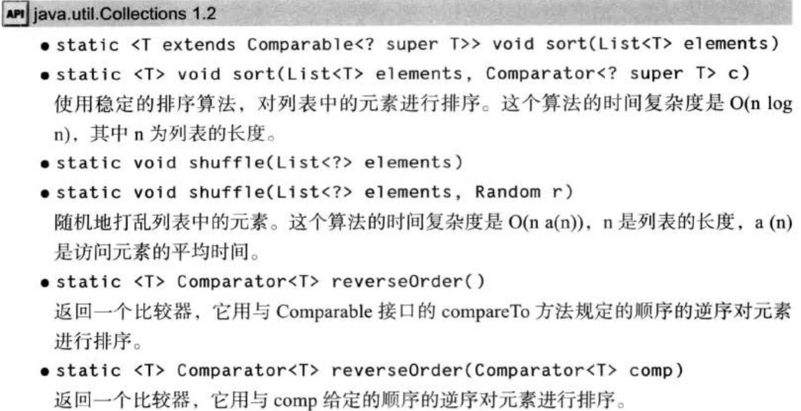

<link rel="stylesheet" type="text/css" href="css/CoreJava.css">  
<script type="text/javascript" src="js/CoreJava.js"></script>  

# <span id="top">Core Java Volume I</span>  

[TOC]

## 基础
>1. java中 **没有** 任何无符号类型（unsigned）

>2. 若果需要在计算中不含有任何舍入误差，可以使用 **BigDecimal**

>3. Integer/0抛出异常   double(float)/0得到无穷大或者NaN（0/0）

>4. (n & 0b1000) / 0b1000   位模式屏蔽其他位
>5. (n & (1 << 3)) >> 3 同上  >>> 运算符将用0填充高位；>> 用符号位填充高位。没有 <<< 运算符

>6. 如果试图将一个数值从一种类型强制转换为另一种类型，而又超出了目标类型的表示范围，结果就会截断成一个完全不同的值，例如， (byte) 300 的实际值为 44

>7. 一定不能用 == 运算符检测两个字符串是否相等！这个运算符只能确定两个字符串是否指向同一位置。实际上在虚拟机中只有字符串常量是共享的，而 + 和 substring等操作产生的结果并不是共享的。

>8. 代码点和代码单元。char数据类型是一个采用UTF-16编码表示的Unicode代码点的代码单元。大多数的常用Unicode字符使用一个代码单元就可以表示，而辅助字符需要一对代码单元表示。
    ```java
    int cp = sentence.codePointAt(i);
    if (Character.isSupplementaryCodePoint(cp)) i += 2;
    else i++;
    ```

>9. Console控制台读取密码：  
    ```java
    Console cons = System.console();
    char passwd = cons.readPassword("password: ");
    ```

>10. printf、String.format格式化输出
    * 转换符：
>>| 转换符| 类型                 | 举例            |    | 转换符| 类型                           | 举例      |
>>| :-------:|:---------------------| :---------------|    | :-------:|:------------------------------| :----------|
>>| d        | 十进制整数       |159              |   | s        | 字符串                         |Hello   |
>>| x        | 十六进制整数   |9f                |   | c        | 字符                             |H            |
>>| o        | 八进制整数       |237              |   | b        | 布尔值                         |True     |
>>| f        | 定点浮点数       |15.9             |   | h        | 散列码                         |42628b2|
>>| e        | 指数浮点数       |15.9e+01     |   | tx      | 日期时间                     |              |
>>| g        | 通用浮点数       |——             |   | %       | 百分号                         |%           |
>>| a        | 十六进制浮点数|ox1.fccdp3|   | n        | 与平台有关的行分隔符|——       |
    * 标志：
>>| 标志| 目的                 | 举例            |
>>| :-----|:---------------------| :---------------|
>>| +        | 打印正数和负数的符号       |+3333.33|
>>| 空格        | 在正数之前添加空格       | 3333.33 &nbsp;|
>>| 0       | 数字前面补0       |003333.33|
>>| -        | 左对齐       ||3333.33 ||
>>| \(        | 将负数括在括号内       |(3333.33)|
>>| ,        | 添加分组分隔符       |3,333.33|
>>| #(对于f格式)        | 包含小数点       |3333.|
>>| #(对于x或o格式)        | 添加前缀0x或者0       |0xcafe|
>>| $        | 给定被格式化的参数索引。例如，%1$d, %1$x将以十进制和十六进制打印第一个参数      |159     9F |
>>| <        | 格式化前面说明的数值。例如，%d%< x以十进制和十六进制打印同一个数值       |159  9F|
    * PS: s转换符可以格式化任何对象，对实现了Formattable借口的对象调用formatTo方法，否则调用toString
    * 格式说明符语法
>>

>11. 简单输入输出
>>采用命令行方式启动程序时可以用重定向将文件绑定到System.in和System.out
>>java MyProg < myfile.txt > output.txt

>12. 带label的break

## 对象与类
>1. java程序设计语言总是按值调用的。
>>方法得到的是所有参数值的一个拷贝，特别是，方法不能修改传递给它的任何参数变量的内容。
    ```java
    public static void swap(Employee x, Employee y) {
        Employee temp = x;
        x = y;
        y = temp;
    }
    ```
>>如果java对对象采用的是引用调用，那么这个方法应该能实现交换数据的效果(事实上并没有)：
    ```java
    Employee a = new Employee("Alice", ...);
    Employee b = new Employee("Bob", ...);
    swap(a, b);
    //does a now refer to Bob, b refer to Alice?
    ```
>2. 命令行基目录编译：
    ```
    javac com/company/App.java
    java com.company.App
    ```
>3. 类设计技巧
    * 一定要保证数据私有
    * 一定要对数据初始化
    * 不要在类中使用过多的基本类型（用其他类来代替多个相关的基本类型的使用）
    * 不是所有的域都需要getter和setter
    * 将职责过多的类进行分解
    * 类名和方法名要能体现它们的职责（类名：名词、形容词或动名词修饰的名词）

## 继承
>1. 如果子类的构造器没有显式的调用超类的构造器，则将自动的调用超类默认（无参）的构造器。这时候如果超类没有无参构造器，java编译器将报告错误。

>2. 包含一个或者多个抽象方法的类，必须声明为抽象类。
    除了抽象方法之外，抽象类还可以包含具体数据和具体方法。
    抽象类不能被实例化。

>3. 归纳一下Java用于控制可见性的4个访问修饰符：
    * 仅对本类可见——private。
    * 对所有类可见——public。
    * 对本包和所有子类可见——protected。（实际应用中要谨慎使用protected属性。protected方法更具有实际意义。）
    * 对本包可见——默认，不需要修饰符。

>4. Java语言规范要求equals方法具有以下特性：
    * **自反性**：对于任何非空引用x，`x.equals(x)`应该返回`true`。
    * **对称性**：对于任何引用x和y，当且仅当`y.equals.(x)`返回`true`时，`x.equals(y)`也应该返回`true`。
    * **传递性**：对于任何引用x、y和z，如果`x.equals(y)`返回`true`，`y.equals(z)`也返回`true`，`x.euqals(z)`也应该返回`true`。
    * **一致性**：如果x和y引用的对象没有发生变化，反复调用`x.equals(y)`应该返回同样的结果。
    * 对于任意非空引用x，`x.equals(null)`应该返回`false`。

>5. 编写一个完美的equals方法的建议：
    1. 显示参数命名为otherObject，稍后需要将它转换成另一个叫other的变量。
    2. 检测this和otherObject是否引用同一个对象：
    `if (this == otherObject) return true;`
    这条语句只是一个优化。实际上，这是一种经常采用的形式。因为计算这个等式要比一个一个地比较类中的域所付出的代价小得多。
    3. 检测otherObject是否为null，如果为null，返回false。这项检测是很必要的。
    4. 比较this和otherObject是否属于同一个类。如果equals的语义在每个子类中有所改变，就使用getClass检测：
    `if (getClass() != otherObject.getClass()) return false;`
    如果所有子类equals有统一的语义，就是用instanceof检测：
    `if (!(otherObject instanceof ClassName))  return false;`
    5. 将otherObject转换成相应的类类型变量：
    `ClassName other = (ClassName) otherObject;`
    6. 现在可以开始对所有需要比较的域进行比较了。使用 == 比较基本类型域，使用equals比较对象域。
    ```java
    return field1 == other.field1
        && Objects.equals(field1, other.field2)
        && ...;
    ```
    note: 如果在子类中重新定义equals，就要在其中包含调用super.equals(other);

>6. hashCode.
    hashCode定义在Object类中，因此每个对象都有一个默认的散列码，其值为对象的存储地址。
    Java7   null安全的Objects.hashCode。组合多个散列值，Objects.hash(Objects objects...);
    如果存在数组类型的域，可以使用静态的Arrays.hashCode方法计算一个散列码，这个散列码由数组元素的散列码组成。

>7. ArrayList.
    * `ensureCapacity()`;<br/><br/>
    * 一旦能够确认数组的大小不再发生变化，就可以调用`trimToSize()`方法。这个方法将存储区域的大小调整为当前元素数量所需要的存储空间数目。垃圾回收器将回收多余的存储空间。
        一旦整理了数组列表的大小，添加元素将花时间再次移动存储块，所以应当在确认不会添加任何元素时，再调用trimToSize。<br/><br/>
    * **Warn**：分配数组列表，如下所示：
    `new ArrayList<>(100)    //capacity is 100`
    它与为新数组分配空间有所不同：
    `new Employee[100]   //size is 100`
        数组列表的容量与数组的大小有一个非常重要的区别。如果为数组分配100个元素的存储空间，数组就有100个空位置可以使用。而容量为100个元素的数组列表只是拥有保存100个元素的潜力（实际上重新分配空间的话，将会超过100），但是在最初，甚至是完成初始化构造之后，数组列表根本就不含有任何元素。

>8. 反射机制可以被用来：
    * 在运行中分析类
    * 在运行中查看对象，例如编写一个tiString方法供所有类使用。
    * 实现通用的数组操作代码。
    * 利用Method对象，这个对象很像C++中的函数指针。

>9. 利用反射分析类的能力：
    Field、Method、Constructor
    Modifier类的isPublic、isPrivate或isFinal、toString
    Class类中的getFields、getMethods、getConstructors分别返回类的public域、方法、和构造器数组，其中包括超类的公有成员。Class类的getDeclaredFields、getDeclaredMethods、getDeclaredConstructors方法将返回类中申明的全部域、方法和构造器，其中包括私有和受保护成员，但不包括超类的成员。
    AccessibleObject的setAccessible和isAccessible
    * 利用这样的能力，可以编写一个通用的toString方法。

>10. 使用反射编写泛型数组代码
    编写一个通用的copyOf拓展已经填满的数组。
    基本数据类型没有超类。
    但int[]超类是Object。int[]可以转换为Object，但不能转换为对象数组。

>11. 利用反射调用任意方法。
    利用`Method getMethod(String name, Class... parameterTypes)`获取Method对象。
    Method的invoke方法invoke(Object obj, Objects... args)，如果调用的是静态方法第一个参数为null
    * **建议**：仅在必要的时候才使用Method对象（比直接调用方法明显慢，而且容易出错），而最好使用接口和内部类。特别重申：建议Java开发者不要使用Method对象的回调功能。使用接口进行回调会使得代码的执行速度更快、更易于维护。

>12. 继承设计的技巧
    1). 将公共操作和域放在超类。
    2). 不要使用受保护的域。
    3). 使用继承实现"is-a"关系。
    4). 除非所有继承的方法都有意义，否则不要使用继承。
    5). 在覆盖方法时，不要改变预期的行为。
    6). 使用多态，而非类型信息。
        无论是么时候，对于下面这种形式的代码
        ```java
        if (x is of type 1)
            action1(x);
        else if (x is of type 2)
            action2(x);
        ```
        都应该考虑使用多态性。
    7). 不要过多地使用反射。
    反射机制使得人们可以通过运行时查看域和方法，让人们编写出更具有通用性的程序。这种功能对于编写系统程序来说及其实用，但是通常不适用于编写应用程序。反射时很脆弱的，即编译器很难帮组人们发现程序中的错误，因此只有在运行时才发现错误并导致异常

## 接口与内部类
>1. 在java程序设计语言中，接口不是类，而是对类的一组需求描述，这些类要遵从接口描述的统一格式进行定义。
不能用new实例化一个接口。
接口中不能包含实例域或静态方法，可以包含常量。
接口中的方法自动设为public，域自动设为public static final。

>2. 对象克隆
浅拷贝：对类对象的各个域进行对应的简单拷贝（对引用类型直接拷贝了引用）。Object默认的clone为浅拷贝
深拷贝：浅拷贝的基础上，克隆所有可变的实例域。（对子对象进行克隆）
所有数组类型均包括一个public的clone方法，用来拷贝数组。
也可以使用序列化实现克隆对象的机制，这种机制很容易实现并且也很安全，但是效率较低。

>3. 接口与回调
javax.swing.Timer类接收一个监听器对象（实现ActionListener）。到达时间间隔，定时器调用actionPerformed方法。

>4. 内部类的作用：
    * 内部类方法可以访问该类定义所在作用域中的数据，包括私有数据。
    * 内部类可以对同一个包中的其他类隐藏起来。
    * 当想要定义一个回调函数且不想大量编写代码时，使用匿名（anonymous）内部类比较便捷。

>5. 内部类的特殊语法规则：
    *内部类中可以使用`OuterClass.this`表示外围类引用
    *反过来，可以使用`outerObject.new InnerClass(construction parameters)`调用内部类构造器。

>6. 局部内部类
局部类不能用public或private访问说明符进行声明。它的作用域被限定在声明这个局部类的块中。对外部世界可以完全的隐藏起来。
局部内部类不仅可以访问包含它的外部类，还可以访问局部变量。但是这些局部变量必须被声明为final。此时局部类会在实例中保存一份该变量的备份。

>7. 匿名内部类
一次性的局部类，就不必命名了
    ```java
    new SuperType(construction parameters) {
        inner class methods and data
    }
    ```
双括号初始化：外层括号建立了ArrayList的匿名子类，内层括号则是一个对象构造块。
    ```java
    invite(new ArrayList<String>() {{ add("Harry"); add("Tony")}});
    ```

>8. 静态内部类
在内部类不需要访问外围类对象的时候，应该使用静态内部类。也有人用嵌套类（nested class）表示静态内部类。
声明在接口中的内部类自动成为static和public类。

## 部署应用程序
>1. Jar文件
MENIFEST.MF清单文件。
使用Main-Class：指定程序入口。指定类名不能带.class后缀。
清单文件最后一行必须一换行符结束。否则将无法被正确读取。

>2. 属性映射
System.getProperties, System.getProperty
Properties类
属性默认值`String title = setting.getProperty("title", "Default Title")`
或者用默认映射`Properties properties = new Properties（defaultProperties）`

>3. Preferences
以树的形式储存属性值。提供一个与平台无关的中心知识库。

## 异常、断言、日志和调试
>1. Java异常层次结构简化图

Error类描述Java运行时系统的内部错误和资源耗尽错误。
RuntimeException和非RuntimeException。“如果出现RuntimeException，那么一定就是你的问题”
Java将派生域Error类和RuntimeException类的所有异常称为 *未检查（unchecked）异常*， 所有其他的异常称为 *已检查（checked）异常*。编译器将核查是否为所有的已检查异常提供了异常处理器。

>2. 遇到下面4中情况应该抛出异常：
    1). 调用一个抛出已检查异常的方法。
    2). 程序运行中发现错误，并且利用throw语句抛出一个已检查异常。
    3). 程序出现错误，例如，a[-1] = 0会抛出一个ArrayIndexOutOfBoundsException这样的未检查异常
    4). java虚拟机和运行时库出现的内部错误。
    不需要声明java内部错误，即从Error继承的错误。也不应该声明从RuntimeException继承的那些未检查异常。总之，一个方法必须声明所有可能抛出的已检查异常，而未检查异常要么不可控制（Error），要么就应该避免发生（RuntimeException）。
    * **WARN**： 子类覆盖超类的方法，声明的已检查异常不能必超类的更通用。

>3. 对实现了AutoCloseable接口的资源类，Java SE 7可以使用带资源的try语句.
```java
try (Resource res = ...) {
    work with res
}
```
try块退出时，会自动调用`res.close()`.

>4. 可以调用Throwable类的getStackTrace方法获取StackTraceElement对象的一个数组，可以再程序中分析这个对象数组。
静态的Thread.getAllStackTrace方法，可以返回所有线程的堆栈跟踪。
```java
Map<Thread, StackTraceElement[]> map = Thread.getAllStackTrace();
for (Thread t : map.keySet()) {
    StaceTraceElement[] frames = map.get(t);
    analyze frames
}
```

>5. 使用异常机制的技巧
    1). 异常机制不能代替简单的测试
    举例：两个版本对一个空栈进行退栈操作
    ```java
    if (!s.empty()) s.pop();
    ```
    ```java
    try {
        s.pop();
    }
    catch (EmptyStackException e) {
    }
    ```
    测试调用isEmpty版本运行时间为646ms，捕获异常版本的运行时间为21739ms
    **只有在异常情况下使用异常机制**<br/>
    2). 不要过分的细化异常
    有必要将整个任务包装在一个try语句中，这样，当任何一个操作出现问题时，整个任务都可以取消。<br/>
    3). 利用异常层次结构
    不要只抛出RuntimeException异常。应该寻找更加适当的子类或创建自己的异常类。
    不要只捕获Throwable异常，否则会使程序更难读、更难维护。
    考虑已检查异常与未检查异常的区别。已检查异常本来就很庞大，不要为逻辑错误抛出这些异常。
    将一种异常转换成另一种更加适合的异常时不要犹豫。例如，在解析某个文件的一个整数时，捕获NumberFormatException异常，然后将它转换成IOException或MySubsystemException的子类<br/>
    4). 不要压制异常<br/>
    5). 在检测错误时，“苛刻”要比放任更好
    当检测到错误时，不应该惧怕抛出异常。在用无效的参数调用一个方法时，返回一个虚拟的数值，还是抛出一个异常？例如，当栈空时，Stack.pop是返回一个null还是抛出一个异常？CoreJava认为：在出错的地方抛出一个EmptyStackException异常要比后面抛出一个NullPointException异常更好。<br/>
    6). 不要羞于传递异常

>6. 断言
>7. 调试技巧
    1). 利用Throwable类的printStackTrace方法，可以从任何一个异常对象中获得堆栈信息。也可以在任何位置插入`Thread.dumpStack()`来获得堆栈跟踪。
    2). 一般来说堆栈跟踪显示在System.err上。也可以用`printStackTrace(PrintWriter s)`发送到其他地方。
    3). 将错误信息保存在一个文件中是非常有用的。然而错误信息被发送到System.err中而不是System.out中。因此不能用`java MyProgram > errors.txt`获取。可以采用`java MyProgram 2> error.txt`获取错误流。也可以使用`java MyProgram >& error.txt`在同一个文件中同时捕获System.err和System.out。
    4). 让非捕获异常的堆栈跟踪出现在System.err中并不是一个理想的方法。比较好的方式是将这些内容记录到一个文件中。可以调用静态的`Thread.setDefaultUncaughtExceptionHandler`方法改变非捕获异常的处理器：
    ```java
    Thread.setDefaultUncaughtExceptionHandler(
        new Thread.UncaughtExceptionHandler() {
            public void uncaughtException(Thread t, Throwable e) {
                save information in log file
            }
        });
    ```
    5). 使用`-verbose`观察类的加载过程。有助于诊断由类路径引发的问题。
    6). Xlint选项告诉编译器对一些普遍容易出现的代码问题进行检查。例如，使用`javac -Xlint:fallthrough`进行编译，当switch语句缺少break语句时，编译器会给出报告。
    下面列出了可使用的选项：
    
    7). 使用jconsole，可以用于显示虚拟机性能的统计结果。`jconsole processID`
    8). 可以使用jmap实用工具获得一个堆的转储，其中显示了堆中的每个对象。使用命令如下：
    ```
    jmap -dump:format=b,file=dumpFileName processID
    jhat dumpFileName
    ```
    然后进入localhost:7000，将会运行一个网络应用程序，借此探查转储对象时堆的内容。
    9). 使用`-Xprof`标志运行Java虚拟机，就会运行一个基本的剖析器来跟踪那些代码中经常被调用的方法。剖析信息将发送给System.out输出结果中还会显示哪些方法是由即时编译器编译的。

## 泛型
>1. 在Java库中，使用变量E表示集合的元素类型，K和V分别表示表的关键字与值的类型。T（需要时还可以用临近的字母U和S）表示“任意类型”。

>2. `<T extends BoundingType>`使用extends而不是implements，表示T是绑定类型的子类型（subtype）.T和绑定类型可以是类，也可以是接口。选择extends的原因时更接近子类的概念。

>3. 一个类型变量或通配符可以有多个限定，如`T extends Comparable & Serializable`如果用一个类作为限定，他必须时限定列表中的第一个。

>4. 在虚拟机中泛型类型变量会被擦除，自动提供一个相应的原始类型（rae type）。原始类型用第一个限定的类型变量来替换，没有则用Object。

>5. 翻译泛型表达式和方法，编译器都会自动插入类型强转。
方法擦除在泛型被继承时， 可能带来复杂问题。翻译泛型方法时可能非常奇怪。子类覆盖超类泛型方法时，参数类型的不同，可能导致多态和类型擦除发生冲突。编译器为解决这个问题，会生成一个桥方法（bridge method）。
返回类型不同，在编码中时不允许的，但是虚拟机能用参数类型和返回类型去顶一个方法。因此编译器可能产生两个仅返回类型不同的方法字节码，虚拟机能够正确处理这一情况。

>6. 总之，需要记住有关java泛型转换的事实：
    *虚拟机中没有泛型，只有普通的类和方法
    *所有的类型参数都用它们的限定类型替换
    *桥方法被合成来保持多态
    *为保持类型安全性，必要时插入强制类型转换

>7. 运行时类型查询不适用于泛型
`if (a instanceof Pair<String>) //WARNING--can only test that a is a Pair`
事实上仅检测a是否是任意类型的一个Pair。
`Pair<String> p = (Pair<String>) a; //ERROR`
无论何时使用instanceof或者涉及泛型类型的强制类型转换表达式都会看到一个编译器警告。
同理，getClass方法总是返回原始类型。

>8. 不能创建参数化类型的数组
`Pair<String> table = new Pair<String>[10]; //ERROR`
声明类型为Pair<String>[]变量任然是合法的，不过不允许new Pair<String>[10]初始化这个变量。
如需收集参数化类型对象，只有一种安全而有效的方法ArrayList：`ArrayList<Pair<String>>`。

>9. Varargs警告
结合8考虑向参数个数可变的方法传递一个泛型类型的实例
```java
public static <T> void addAll(Collection<T> coll, T... ts) {
    for(T t : ts) coll.add(t);
}
```
kao
```java
Collection<Pair<string>> table = ....;
Pair<String> a = ...;
Pair<String> b = ...;
addAll(table, a, b);
```
为了调用addAll，java虚拟机必须建立一个`Pair<String>`数组，这就违反了前面的规则。不过对于这种情况，规则有所放松，只得到一个警告，可以用`@SuppressWarnings("unchecked")`或者Java SE7的`@SafeVarargs`来抑制这个警告。

>10. 不能实例化类型变量
不能使用像`new T(...)`, `new T[...]`或者`T.class`,类型擦除会将T变成Object
要获取类型变量的实例，必须如下设计API：
```java
public static <T> Pair<T> makePair(Class<T> cl) {
    try {
        return new Pair(cl.newInstance, cl.newInstance);
    } catch (Exception ex) {return null;}
}
```

>11. 泛型类的静态上下文中类型变量无效
禁止使用带有类型变量的静态域和方法。

>12. 不能抛出或者捕获泛型类的实例
不过在异常规范中使用类型变量是允许的
```java
public static <T extends Throwable> void doWork(T t) throws T { //OK
    try {
        do work
    } catch (Throwable realCause) {
        t.initCause(realCause);
        throw t;
    }
}
```
可参考利用泛型消除对已检查异常的检查。

>13. 注意类型擦除后的冲突

>14. 通配符限定、通配符捕获。

### 反射和泛型
>1. Class<T>
String.class是Class<String>类唯一的对象。

>2. Type接口
    * Class类，描述具体类型
    * TypeVariable接口，描述类型变量（如T extends Comparable<? extends T>）。
    * WildcardType, 描述通配符。（如? super T>）。
    * ParameterizadType接口，描述泛型类或者泛型接口类型（如 Comparable<? super T>）。
    * GenericArrayType接口，描述泛型数组（如 T[]）。

## 集合

### 迭代器Iterator接口
1. 应该将java迭代器认为是位于 *两个元素之间*。当调用`next`时，迭代器就 *越过* 下一个元素，并返回刚刚越过的那个元素的引用。类似下图：

2. 用迭代器删除元素时必须要先越过这个元素。调用Iterator的`remove`方法前，必须先调用`next`越过将要被删除的元素。
Iterator中没有add方法。

### 链表
1. 在Java中，所有的链表实际上都是 *双向链接（doubly linked）* 的。
2. ListIterator
ListIterator可以反向遍历链表使用`previous()` 和`hasPrevious()`
add方法，类似一个光标在链表指定位置插入一个元素。
add方法只依赖于迭代器的位置，但是remove方法依赖于迭代器的状态，删除它越过的元素。
set方法用一个新元素取代调用next或previous方法返回的上一个元素，即取代迭代器刚越过的元素。

3. 并发的修改链表，可能会导致出现ConcurrentModificationException，但列表只跟踪对列表结构性修改，例如添加、删除元素。set方法不被视为结构性修改。Collections类的许多算法都需要使用这个功能。
4. 链表不支持快速的随机访问。
需要采用整数索引访问元素时，通常不选用链表。
尽管如此，LinkedList还是提供了一个get方法。这个方法的效率并不高。如果，发现正在使用这个方法，说明有可能对于要解决的问题使用了错误的数据结构。绝对不要用这种方法来遍历链表，效率极低。
get方法做了小小的优化，如果索引大于`size()/2`就从链表尾端开始搜索元素。

5. 链表迭代器还有一个告知当前位置的索引
`nextIndex`返回下一次调用next返回元素的整数索引
`previousIndex`返回下一次调用previous返回元素的整数索引
list.listIterator(n)返回指向索引为n的元素前面位置的迭代器。获得这个迭代器效率较低。
使用链表的唯一理由是尽可能减少在列表中间插入和删除元素的开销。
如果要对集合进行随机访问，就是用数组或ArrayList，而不要使用链表。

### 数组列表
1. ArrayList封装了一个动态再分配的对象数组。可以使用get和set方法随机地访问每一个元素。

2. Vector类的所有方法都是同步的，建议在不需要同步时使用ArrayList，而不要使用Vector。

### 散列集
1. 数据结构散列表（hash table）在java中用链表数组实现。每个列表被称为桶（bucket）。计算散列码与桶数取余，得到保存元素的桶的索引。
散列表可以用来实现几个重要的数据结构。其中最简单的是Set类型。

2. HashSet，实现了基于散列表的集。
add添加元素，contains快速查看某个元素是否已存在集中，它只需要在某个桶中查找。
只有在不关心元素顺序时才使用HashSet

### 树集
1. TreeSet类与散列集十分类似。
树集是一个有序集合（sorted collection），可以以任意顺序插入元素到集合中。在对集合进行遍历时，每个值将自动地按照排序后的顺序呈现。

2. 正如TreeSet类名所示，排序是用树结构完成的（当前实现使用的是红黑树）。
将一个元素添加到树中要比添加到散列表中慢，但是，与将元素添加到数组或链表的正确位置上相比还是快很多的。

* Note： 从Java SE6起，TreeSet类实现了`NavigableSet`接口。这个接口增加了几个用于定位元素以及反向遍历的方法。

### 对象的比较
1. 对于需要排序的集合，需要知道按何种规则排列对象。必须明确知道对象的比较方式。
2. 在默认情况下，树集假定插入的元素实现了Comparable接口。使用该接口定义的compareTo方法进行排序。
然而使用Comparable接口的 *局限性* 在于，对于一个给定的类只能实现这个接口一次。如果一个类需要在不同的情况下使用不一样的排序规则，Comparable接口就无能为力了，又或者这个类的创建者没有费心实现Comparable接口
在这种情况下可以通过将Comparator对象传递个TreeSet构造器来告诉树集使用不同的比较方法。
3. Comparator接口申明了一个带有两个显式参数的compare方法：
```java
public interface Comparator<T> {
    int compare(T a, T b);
}
```
与compareTo方法一样， a在b之前返回负值，相等返回0，否则返回正值
定义一个实现Comparator接口的类，然后将这个类的对象传递给TreeSet的构造器
```java
ItemComparator comp = new ItemComparator();
SortedSet<Item> sortByDescription = new TreeSet<>(com);
```
这个比较器没有任何数据，它只是比较方法的持有器。有时将这种对象成为 *函数对象(function object)*。函数对象通常 “动态” 定义，即定义为匿名内部类的实例：
```java
SortedSet<Item> sortByDescription = new TreeSet<>(
    new Comparator<Item>() {
        public int compare(Item a, Item b) {
            String descrA = a.getDescription();
            String descrB = b.getDescription();
            return descrA.compareTo(descrB);
        }
    });
```

* Note：实际上Comparator<T>接口申明了两个方法compare和equals。大多数情况下不需要覆盖equals方法。但在某些情况下可以提高效率。

### 队列与双端队列
1. 队列可以有效地在尾部添加一个元素，在头部删除一个元素。

2. 有两个端头的队列， 即 *双端队列（Deque）*， 可以有效的在头部和尾部添加和删除元素。

3. 不支持在队列中间添加元素。

4. Java SE6引入了Deque接口，ArrayDeque和LinkedList实现了该接口。


### 优先级队列
1. 优先级队列（priority queue）中的元素可以按照任意的顺序插入，却总是按照排序的顺序进行检索。无论何时调用remove方法，都会获得当前优先级队列中最小的元素。
2. 然而优先级队列并没有对所有的元素进行排序。
3. 优先级队列使用了一个优雅且高效的数据结构，堆（heap）。堆是一个可以自我调整的二叉树，对树执行add和remove操作，可以让最小的元素移动到根，而不必花时间堆元素进行排序。

### 映射表（Map）
1. 两个通用实现：HashMap和TreeMap。
散列映射表（HashMap）对键进行散列，树映射表（TreeMap）用键的整体顺序对元素进行排序，并将其组织成搜索树。

2. 集合框架并没有将Map本身视为一个集合。
然而，可以获得Map的3个Collection视图：键集，值集合（不是集）和键/值对集。
```java
Set<K> keySet()
Collection<k> values()
Set<Map.Entry<K, V>> entrySet()
```
keySet既不是HashSet，也不是TreeSet。
使用这些集合视图的迭代器可以删除元素，但是不能调用add方法。如果试图调用add方法，将会抛出一个UnsupportedOperationException异常。


### 专用集与映射表类
1. 弱散列映射表（WeakHashMap）
如果有一个值，对应的键已经不再使用了，但是垃圾回收器是不能删除它的，除非整个映射表对象是不活动的。
WeakHashMap类就是用来解决这个问题的。

2. 链接散列集（LinkedHashSet）和链接散列映射表（LinkedHashMap）
Java SE 1.4增加了两个类： LinkedHashSet和LinkedHashMap，用来记住插入元素项的顺序。

链接散列表将用访问顺序，而不是插入顺序，对映射表进行迭代。每次调用get或put，受影响的条目将从当前的位置删除，并放到条目链表的尾部。
`LinkedHashMap<K, V>(initialCapacity, loadFactor, true)`
访问顺序对于实现高速缓存的“最近最少使用”原则十分重要。
removeEldestEntry,每当方法返回true时，就添加一个项目，从而导致删除eldest条目。
下面的高速缓存可以存放100个元素：
```java
Map<K, V> cache = new LinkedHashMap<>(128, 0.75F, true) {
    protected boolean removeEldestEntry(Map.Entry<K, V>  eldest) {
        return size() > 100;
    }
};
```

3. 枚举集与映射表
EnumSet是一个枚举类型元素集的高效实现。由于枚举类型只有有限个实例，所以EnumSet内部用位序列实现。如果对应的值在集中，则相应的位被置为1。
EnumSet类没有公共的构造器。可以使用静态工厂方法：
```java
enum Weekday { MONDAY， TUESDAY， WEDNESDAY， THURSDAY， FRIDAY， SATURDAY， SUNDAY}；
EnumSet<Weekday> always = EnumSet.allOf(Weekday.class);
EnumSet<Weekday> never = EnumSet.noneOf(Weekday.class);
EnumSet<Weekday> workday = EnumSet.range(Weekday.MONDAY, Weekday.FRIDAY);
EnumSet<Weekday> mwf = EnumSet.of(Weekday.MONDAY, Weekday.WEDNESDAY, Weekday.FRIDAY);
```
EnumMap是一个键类型为枚举类型的映射表。它可以直接且高效地用一个值数组实现。在使用时，需要在构造器中指定键类型：
`EnumMap<Weekday, Employee> personInCharge = new EnumMap<>(Weekday.calss);`
所有的枚举类型都拓展于泛型Enum类。

4. 标识散列映射表
Java SE1.4还为另外一个特殊目的增加了另一个类IdentifyHashMap。在这个类中键的散列值不是用hashCode函数计算的，而是用System.identifyHashCode方法计算的。这是Object.hashCode方法根据对象的内存地址来计算散列码时多使用的方式。而且，在对两个对象进行比较时，IdentifyHashMap类使用 == ，而不是equals。
在实现对象遍历算法（如对象序列化）时，这个类非常有用，可以用来跟踪每个对象的遍历状况。


### 集合框架
框架（framework）是一个类的集，它奠定了创建高级功能的基础。框架包含很多超类，这些超类拥有非常有用的功能、策略和机制。框架使用者创建的子类可以扩展超类的功能，而不必重新创建这些基本的机制。

<span style="display: block;text-align: center;">集合框架的接口</span>

1. List是一个有序集合（ordered Collection）。元素可以添加到容器某个特定的位置。将对象放置在某个位置上可以采用两种方式：使用整数索引或列表迭代器。List定义了几个用于随机访问的方法：`void add(int index, E element)` `E get(int index)` `void remove(int index)`
但List在提供这些随机访问方法时，并不管它们对某种特定的实现是否高效。为了避免执行成本较高的随机访问操作，Java SE1.4引入了一个标记接口RandomAccess。ArrayList和Vector都实现了该接口。

2. 可以直接扩展集合接口的抽象类类实现自己的集合类，以避免动手实现大量的基本方法。

<span style="display: block;text-align: center;">集合框架中的类</span>

#### 视图与包装器
通过使用视图（views）可以获得其他的实现了集合接口和映射表接口的对象。笔者认为：views可以视为对同一事物（以不同角度观察）的不同描述方式。例如keySet方法返回的一个实现Set接口的类对象。

1. 轻量级包装器
Arrays的静态方法asList返回的是一个包装了普通java数组的List包装器。
```java
Card[] cardDeck = new Card[52];
List<Card> cardList = Arrays.asList(cardDeck);
```
返回的对象不是ArrayList。它是一个视图对象，可以使用get和set方法。所有改变数组大小的方法（例如，与迭代器相关的add和remove方法）都会抛出一个UnsupportedOperationException。
Java SE1.5开始，asList除了接收数组外，还能以可变参数的形式接收数组的各个元素。
`List<String> names = Arrays.asList("Amy", "Bob", "Carl");`
这个方法调用`Collections.nCopies(n, anObject)`将返回一个实现了List接口的不可修改对象。
例如`List<String> settings = Collections.nCopies(100, "DEFAULT");`创建一个包含100个字符串的List，每个字符串被设置为“DEFAULT”。
`Collections.singleton(anObject)`
返回一个视图对象。返回的对象实现了一个不可修改的单元素集，而不需要付出建立数据结构的开销。singletonList和singletonMap类似。

2. 子范围
可以为很多集合建立子范围（subrange）视图。
`List group = staff.subList(10, 20);`
与String类的substring类似，获得一个列表的子范围视图。
可以将任何操作作用于子范围，并且能够自动地反映到整个列表的情况。
例如，可以删除整个子范围：`group.clear(); //staff reduction`
现在元素自动地从staff列表中清除了，并且group为空。

对于有序集和映射表，可以使用元素值的范围而不是元素位置建立子范围。
SortedSet接口：
```java
SortedSet<E> subSet(E from, E to);
SortedSet<E> headSet(E to);
SortedSET<E> tailSet(E );
```
这些方法将返回大于等于from且小于to的所有元素子集。
SortedMap接口：
```java
SortedMap<K, V> subMap(K from, K to);
SortedMap<K, V> headMap(K to);
SortedMap<K, V> tailMap(K from);
```
返回映射表视图，该视图包含键落在指定范围内的所有元素。
Java SE1.6引入的NavigableSet接口富裕子范围操作更多的控制能力。可以指定是否包括边界：
```java
NavigableSet<E> subSet(E from, boolean fromInclusive, E to, boolean toInclusive);
NavigableSet<E> headSet(E to, boolean toInclusive);
NavigableSet<E> tailSet(E from, boolean fromInclusive);
```

3. 不可修改的视图
Collections可以产生集合的 *不可修改视图* （unmodifiable views）。这些视图对现有集合增加了一个运行时的检查，如果发现这类视图试图对集合进行修改，就抛出一个异常。同事这个集合将保持未修改的状态。
```java
<T> Collection<T> unmodifiableCollection(Collection<? extends T> c);
<T> List<T> unmodifiableList(List<? extends T> list);
<T> Set<T> unmodifiableSet(Set<? extends T> s);
<T> SortedSet<T> unmodifiableSortedSet(SortedSet<T> s);
<T> NavigableSet<T> unmodifiableNavigableSet(NavigableSet<T> s);
<K,V> Map<K,V> unmodifiableMap(Map<? extends K, ? extends V> m);
<K,V> SortedMap<K,V> unmodifiableSortedMap(SortedMap<K, ? extends V> m);
<K,V> NavigableMap<K,V> unmodifiableNavigableMap(NavigableMap<K, ? extends V> m);
```
由于视图只是包装了接口而不是实际的对象，所以只能访问接口中定义的方法。
unmodifiableCollection方法（与synchronizedCollection和checkedCollection一样）将返回一个集合，它的equals方法不调用底层集合的equals方法，而是继承了Object的equals方法，这个方法只检测两个对象是否是同一个对象。视图将以同样的方式处理hashCode方法。
unmodifiableSet和unmodifiableList使用底层集合的equals和hashCode方法。

4. 同步视图
多线程访问集合可能会带来难以预料的后果。例如，如果一个线程视图将元素添加到散列表中，同时另一个线程正在对散列表进行再散列，其结果将是灾难性的。
类库的设计者使用视图机制来确保常规集合的线程安全，而不是实现线程安全的集合类。
例如，Collections类的synchronizedMap方法可以将任何一个映射表转换成具有同步访问方法的Map：
```java
Map<String, Employee> map = Collections.synchronizedMap(new HashMap<String, Employee>());
```
现在可以由多线程访问Map对象了。像get和put这类方法都是串行操作的，即在另一个线程调用另一个方法之前，刚才的方法调用必须彻底完成。

5. 检查视图
Java SE5.0增加一组“检查”视图，用来对泛型类型发生问题时提供调试支持。
```java
ArrayList<String> strings = new ArrayList<>();
ArrayList rawList = strings;    //get warning onlt, not an error, for compatibility with legavy code
rawList.add(new Date());    //now Strings contains a Date object!
System.out.println(strings.get(0)); //now， we will get a java.lang.ClassCastException: java.util.Date cannot be cast to java.lang.String
```
这个错误的add在运行时检测不到，只有在稍后调用get，并将结果转化为String时，这个类才会抛出异常。
检查视图可以探测到这类问题。
```java
List<String> safeStrings = Collections.checkedList(strings, String.class);
List rawList = safeStrings;
rawList.add(new Date());  //checked list throws a ClassCastException
```
但是对于ArrayList<Pair<String>>，受限于虚拟机的内部实现泛型类型擦除，无法阻止插入Pari<Date>。


#### 批操作
可以使用类库中的 *批操作*（bulk operation）避免频繁地使用迭代器。
假设希望找出两个集的交（intersection）。首先，要建立一个新集，用于存放结果：
`Set<String> result = new HashSet<>(a);`
这里利用了这样的一个事实：每一个集合有一个构造器，其参数是保存初始值的里一个集合。
接着调用retainAll方法：
`result.retainAll(b);`
也可以直接使用`a.retainAll(b)`

可以更进一步，将批操作应用于视图。
```java
Map<String, Employee> staffMap = ...;
Set<String> terminatedIds = ...;

staffMap.keySet().removeAll(terminatedIds);
```

通过使用子范围视图，可以将一个批操作限制于子列表和子集的操作上。
```java
//将一个列表的前10个元素添加到另一个容器
relocated.addAll(staff.subList(0, 10));
//这个子范围也可以成为更改操作的对象
staff.subList(0, 10).clear();
```

#### 集合与数组之间的转换
如果有一个数组需要转换为集合。Arrays.asList的包装器可以实现这个目的。如：
```java
String[] values = ...;
HashSet<String> staff  = new HashSet(Arrays.asList(values));
```
反过来，将集合转换为数组就有点难了。可以使用toArray方法
`Object[] values = staff.toArray();`
但是这样做的结果时产生一个Object数组。及时知道集合中包含一个特定类型的对象，也不能使用类型转换：
`String[] values = (String[]) staff.toArray();   //Error!`
必须使用另一种toArray方法，并将其设计为所希望的元素类型且长度为0的数组。随后返回的数组将与所创建的数组一样：
`String[] values = staff.toArray(new String[0]);`
如果愿意的话，可以构造一个指定大小的数组：
`staff.toArray(new String[staff.size()]);`
在这种情况下，没有创建任何新数组。
`staff.toArray(new String[staff.size() + 1]);`
如果指定大小比原集合容量大，将会得到指定大小的数组，并且超过集合容量位置的元素被初始化为默认值。例如以上例子将得到
`["staff1", "staff2", ..., null]`

**PS:** 为什么不直接将一个Class对象传递给toArray方法。其原因时这个方法具有“ *双重职责* ”，不仅要填充已有的数组（如果足够长，**长度不够将不会被填充**），还要创建一个新的数组。

### 算法
泛型接口有一个很大的有点，即针对集合的算法只需要实现一次。
#### 排序与混排
1. 排序sort
```java
Collections.sort(staff);

Collections.sort(staff, itemComparator);
```
如果想按降序排列，可以使用Collections.reverseOrder()。这个方法将返回一个比较器，比较器返回b.compareTo(a)。如：
```java
Collections.sort(staff, Collections.reverseOrder());

Collections.sort(staff, Collections.reverseOrder(itemComparator));
```
2. 关于sort的实现，Java时直接将所有元素转入一个数组，并使用一种 *归并排序* 的变体对数组进行排序，然后再将排序后的序列复制会列表。

3. 集合类库中使用归并排序算法比快速排序要慢一些，快速排序时通用排序算法的传统选择。
但是，归并排序有一个主要的优点：稳定。即不需要交换相同的元素。例如，将一个员工列表先按姓名排序，再按工资排序，将会得到一个先按工资排序，工资相同者再按照姓名排序的列表。

4. 所有接收集合参数的方法必须描述什么时候可以安全的将集合传递给算法。例如，显然不能将unmodifiableList传递给排序算法。根据文档说明，列表必须是可修改的，但不必是可改变大小的。
下面时有关术语的定义：
如果列表支持set方法，则是 *可修改* 的。
如果列表支持add、remove方法，则是 *可改变大小* 的。

5. Collections类有一个算法shuffle，器功能与排序刚好相反，即随机混排列表中元素的顺序。
如果列表没有实现RandomAccess接口，shuffle方法将元素复制到数组中，然后打乱数组元素的顺序，最后将打乱顺序后的元素复制回列表。



#### 二分查找
Collections类的binarySearch方法实现了二分查找的算法。但是提供给该方法的集合 **必须是排好序** 的，否则算法将返回错误的答案。要想查找某个元素，必须提供集合，这个集合要实现List接口，以及要查找的元素。如果集合没有采用Comparable接口的compareTo方法进行排序，就还需要提供一个比较器对象。
```java
i= Collections.binarySearch(c, element);
i = Collections.binarySearch(c, element, comparator);
```
binarySearch方法如果找到了查找的元素，则返回元素的索引位置（>=0），如果元素不存在，则返回一个可以指示元素应当处在的位置（如果需要将元素插入集合并保持有序的话）。插入位置是`insertionPoint = -i - 1`
下面的操作将把元素插入到正确的位置：
```java
if (i < 0) {
    c.add(-i - 1, element);
}
```

**PS :**只有采用随机访问，二分查找才有意义。如果必须用迭代的方式遍历链表找到中间元素的位置，二分查找将完全失去优势。因此，如果为binarySearch算法提供一个链表，它将自动变为线性查找。
（1.4开始 binarySearch将检查列表是否实现了RandomAccess接口，决定采用二分查找还是线性查找）

#### 简单算法
在Collections类中包含了几个简单实用的算法。
包括查找集合最大最小值；将一个列表中的元素复制到另外一个列表中；用一个常量值填充容器；逆置一个列表的元素顺序。
下面的API注释描述了Collections类的一些简单算法。


### 遗留的集合
Java自问世以来就存在的集合类：Hashtable和非常有用的子类Properties、Vector的子类Stack以及BitSet类。
#### Hashtable
Hashtable与HashMap类作用一样，实际上他们拥有相同的接口。与Vector类的方法一样。Hashtable的方法也是同步的。（ps：Hashtable名字带有一个小写的t）。

与HashMap的不同：
第一，继承不同。
```java
public class Hashtable extends Dictionary implements Map{}
public class HashMap  extends AbstractMap implements Map{}
```
第二，同步不同。

第三，key、value的限制不同。
Hashtable中，key和value都不允许出现null值。
在HashMap中，null可以作为键，这样的键只有一个；可以有一个或多个键所对应的值为null。当get()方法返回null值时，即可以表示HashMap中没有该键，也可以表示该键所对应的值为null。因此，在HashMap中不能由get()方法来判断HashMap中是否存在某个键， 而应该用containsKey()方法来判断。

第四，两个遍历方式的内部实现上不同。
Hashtable、HashMap都可以使用Iterator。而由于历史原因，Hashtable还使用了Enumeration的方式。

第五，哈希值的使用不同。
Hashtable直接使用对象的hashCode。而HashMap重新计算hash值。

第六，初始大小和扩容方式的不同。
Hashtable和HashMap它们两个内部实现方式的数组的初始大小和扩容的方式。Hashtable中hash数组默认大小是11，增加的方式是 old*2+1。HashMap中hash数组的默认大小是16，而且一定是2的指数。

#### 枚举
遗留集合采用Enumeration接口对元素进行遍历。Enumeration接口有两个方法，即hasMoreElements和nextElement。
Hashtable类的elements方法将产生一个用于描述表中各个枚举值的对象：
```java
Enumeration<Employee> e = staff.elements();
while(e.hasMoreElements()) {
    Employee element = e.nextElement();
    ...
}
```

有时还会遇到遗留方法，其参数是枚举类型。静态方法Collections.enumeration将产生一个枚举对象，枚举集合中的元素。例如：
```java
List<InputStream> stream = ... ;
SequenceInputStream in = new SequenceInputStream(Collections.enumeration(stream));
```

#### 属性映射表
属性映射表（property map）是一个类型非常特殊的映射表结构。它有下面3个特性：

* 键与值都是字符串
* 表可以保存到文件中，也可以从文件中加载
* 使用一个默认的辅助表

实现属性映射表的Java平台称为Properties。
属性映射表通常用于程序的特殊配置选项。

#### 栈
从1.0版本开始，标准类库中就包含了Stack类，其中有熟悉的push方法和pop方法。但是，Stack类拓展于Vector类，这种设计并不太令人满意，它可以让栈使用并不属于栈操作的insert和remove方法，即可在任何地方进行插入删除操作，而不仅仅是在栈顶。


#### 位集
Java平台的BitSet类用于存放一个位序列（它不是数学上的集，成为位 *向量* 或 *数组* 更为合适）。如需高效地存储位序列（例如，标志）就可以使用BitSet。由于BitSet将位包装在字节里，所以使用BitSet要比使用Boolean对象的ArrayList更加高效。

BitSet提供了一个便于读取、设置或清除各个位的接口。使用这个接口可以避免屏蔽和其他麻烦的位操作。如果将这些类存储在int或long变量中就必须进行这些繁琐的操作。

例如，对于一个名为bucketOfBits的BitSet，
`bucketOfBits.get(i)`
如果第i位处于“开”状态，就返回true；否则返回false。
`bucketOfBits.set(i)`
将第i位置为“开“状态。
`bucketOfBits.clear(i)`
将第i位置为“关”状态。


“Eratosthenes筛子” *基准测试*
作为位集应用的一个示例，这里给出一个采用“Eratosthenes筛子”算法查找素数的实现（“Eratosthenes筛子”算法是最早发现的用来枚举这些基本数字的方法之一）。这并不是查找素数的最好方法，它已经成为测试编译程序性能的一种流行的基准。（如测试Java和C++的编译性能。这也不是最好的基准测试方法，它主要用于测试位操作。）

下面的程序将计算2~2 000 000之间的所有素数（一共148933个）。程序遍历一个拥有200万个位的位集，首先将所有的位置为“开“状态，然后，将已知素数的倍数所对应的位置都置为“关”状态。经过这个操作保留下来的位对应的就是素数。

```java
public class Sieve{
    public static void main(String[] s) {
        int n = 2000000;
        long start = System.currentTimeMillis();
        BitSet b = new BitSet(n + 1);
        int count = 0;
        int i;
        for (i = 2; i <= n; i++) {
            b.set(i);
        }

        i = 2;
        while (i * i < n) {
            if (b.get(i)) {
                count++;
                int k = 2 * i;
                while (k < n) {
                    b.clear(k);
                    k += i;
                }
            }
            i++;
        }
        while (i < n) {
            if (b.get(i)) count++;
            i++;
        }
        long end = System.currentTimeMillis();
        System.out.println(count + "primes");
        System.out.pringln((end - start) + "milliseconds");
    }
}
```

## 多线程


[<button style="position: fixed; bottom: 50px;right: 50px;height:35px;width:50px;font-size:16px;">TOP</button>](#top)


