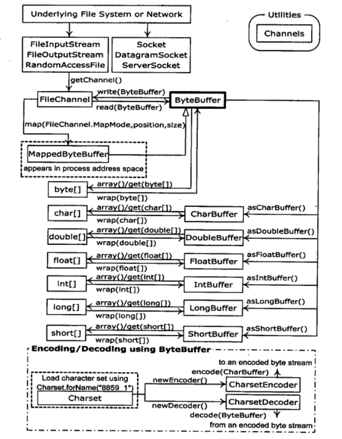

# Thinking in Java
## Java I/O 系统
### New I/O
#### 缓冲器的细节 
Buffer由数据可以高效地访问及操纵这些数据的四个索引组成，它们是：mark（标记），position（位置），limit（界限）和capacity（容量）。下面是设置和复位索引以及查询它们的值的方法。

    -----------------------------------------------------------
        capacity()          返回缓冲区容量
        clear()             清空缓冲区，将position设为0，limit设为容量。我们可以调用此方法复写缓冲区
        flip()              将limit设置为position，position设为0。此方法用于准备从缓冲区读取已写入的数据
        limit()             返回limit值
        limit(int lim)      设置limit值
        mark()              将mark设置为position
        position()          返回position值
        position(int pos)   设置position值
        remaining()         返回（limit-position）
        hasRemaining()      若由介于position和limit之间的元素，则返回true
    -----------------------------------------------------------


#### 内存映射文件
内存映射文件允许我们创建和修改那些因为太大而不能放入内存的文件。有了内存映射文件，我们就可以假设整个文件都放在内存中，而且可以完全把它当做非常大的数组来访问。这种方法极大的简化了用于修改文件的代码。

### 对象序列化
只要对象实现了Serializable接口，对象的序列化处理就会非常简单。
由于Java的对象序列化似乎找不出什么缺点，所以尽量不要自己动手。
#### 序列化的控制
特殊情况下不得不对对象的序列化进行操控。例如，也许要考虑特殊的安全问题，而且你不希望对象的某一部分被序列化；或者对象被还原以后某子对象需要重新创建，从而不必将该子对象序列化。 

在这些特殊情况下，可以通过实现Externalizable接口代替实现Serializable接口对对象序列化过程进行控制。Externalizable接口继承自Serializable接口，同时添加了两个方法：`writeExternal()`和`readExternal()`。这两个方法会在序列化和反序列化还原的过程中被自动调用，以便执行一些特殊的操作。

恢复一个Externalizable对象，与恢复一个Serializable对象不同。对于Serializable对象，对象完全以它存储的二进制为基础构造，而**不调用构造器**。而对于一个Externalizable对象，所有普通的默认构造起都会被调用（包括在字段定义时的初始化），然后调用`readExternal()`。必须注意这一点——所有默认的构造器都会被调用，才能使Externalizable对象产生正确的行为。
##### transient（瞬时）关键字
transient关键字逐个字段关闭序列化

由于Externalizable对象在默认情况下不保存他们的任何字段，所以transient关键字只能和Serializable对象一起使用
##### Externalizable的替代方法
我们可以实现Serializable接口，并添加（注意这里是“添加”，而非“覆盖”或者“实现”）名为`writeObject()`和`readObject()`的方法。
这些方法必须具有准确的方法特征签名：
```java
private void writeObject(ObjectOutputStream stream) throw IOException;
private void readObject(ObjectInputStream stream) throw IOException;
```
这里在设计上看起来是不可思议的，序列化时ObjectOutputStream和ObjectInputStream对象的writeObject()和readObject()方法会调用被序列化对象的writeObject()和readObject()方法。它们会检查（利用反射）Serializable对象是否拥有这两个方法。

可以在writeObject()内部调用defaultWriteObject()来选择执行默认的writeObject()。readObject()类似。

尽管Class类是Serializable的，但它却不能按照我们所期望的方式运作。所以假如想序列化static值，必须自己动手去实现。  

## 并发
### 终结任务
#### 中断
可中断的阻塞： sleep
不可中断的阻塞： 在I/O和synchronized块上的等待

你能够中断对sleep()的调用，但是你不能中断正在**试图**获取synchronized锁或者**试图**执行I/O操作的线程。也可以中断对wait()的调用

要中断I/O阻塞的线程时可是使用关闭I/O资源的方法
nio提供了更人性化的I/O中断。被阻塞的I/O通道会自动相应中断。ClosedByInterrupteException(
被interrupt()中断)，AsynchronousClosException(在阻塞上关闭底层资源)。

ReentrantLock上阻塞的任务具备可以被中断的能力。需要调用 `lock.lockInterruptibly()`。这与在synchronized方法或者临界区上阻塞的任务完全不同。

#### 检查中断
1. 在循环上执行中断检查 `Thread.interrupted()`
2. 使用 `try-finally`释放资源
3. 在阻塞操作上使用InterruptedException来处理中断

### 线程协作
#### wait()与notifyAll()
1. wait()期间对象锁是释放的
2. 可通过notify()、notifyAll()，或者指令到期，从wait()中恢复执行

#### 线程之间协作的几种方式
1. 互斥量（mutex） 同步块、锁、Condition
2. 阻塞队列
3. 管道

### 死锁
#### 哲学家吃饭问题 
死锁的四个条件：

1. 互斥条件。任务使用的资源中至少有一个是不能共享的。
2. 至少有一个任务它必须持有一个资源且正在等待获取一个当前被别的任务持有的资源。
3. 资源不能被任务抢占，任务必须把资源释放当做普通事件。即资源不会被其他任务强抢。
4. 必须有循环等待，这是一个任务等待其他任务所持有的资源，后者又在等待另一个任务
所持有的资源，这样一直下去，直到有一个任务在等待第一个任务所持有的资源。

要防止死锁的话，只需要破坏其中一个条件即可。在程序中，防止死锁最容易的方法是破坏
第4个条件。

### 新类库中的构件
#### CountDownLatch
用来同步一个或多个任务，强制他们等待其他任务执行的一组操作完成。
countDown()将计数器减一， await()将阻塞线程直到计数器变为0

#### CyclicBarrier
当指定数目的任务在barrier上调用await()到达阻塞时，这些任务将得以继续执行，并且可以
随机选择一个线程执行传入barrier的任务

#### Semaphore
正常的锁在任何时刻都只允许一个任务访问一项资源，而*计数信号量*允许n个任务同时访问这个资源。

#### Exchanger
Exchanger是在两个任务之间交换对象的栅栏。当这些任务进入栅栏时，他们各自拥有一个对象，当它们
离开时，它们都拥有之前由对方持有的对象。

#### DelayQueue
延时队列，是一个无界的BlockingQueue，用于放置实现了Delayed接口的对象，其中的对象
只有在到期时才能被取走。这种队列是有序的，即队头对象的延迟到期时间最长。如果没有任何
延时到期，poll()将返回null（因此不能将null放置到这种队列中）。使用take()将会阻塞。

Delayed对象的getDelay()可以理解为获取到期时间，为正时表示还未到期

#### PriorityBlockingQueue

#### ScheduledExecutor

### 仿真
并发最令人兴奋的用法就是创建仿真。通过使用并发，仿真的每个构件都可以成为其自身的任务，这使得仿真
更容易编程。许多视频游戏和电影中的CG动画都是仿真。

#### 银行出纳员仿真
这个经典的仿真可以表示任何属于下面这种类型的情况：对象随机地出现，并且要求由数量有限的服务器提供
随机数量的服务时间。通过构建仿真可以确定理想的服务器数量。

#### 饭店仿真


#### 分发工作

### 性能调优
#### 各种互斥技术比较
“微基准测试”通常指在隔离的、脱离上下文环境的情况下对某个特性进行新能测试。

synchronized、Lock、Atomic
使用Lock通常会比synchronized关键字要高效得多。synchronized的开销看起来变化范围太大，Lock相对比较一致。但是synchronized可读性更好。因此，以synchronized关键字入手，只有在性能调优时才替换为Lock的做法，是具有实际意义的。

Atomic只有在非常简单的情况下才有用，通常包括你只有一个要被修改的对象，且这个对象独立于其他所有的对象。更安全的做法是：以更加传统的互斥方式入手，只有在性能方面的需求能够明确指示时，再替换为Atomic

#### 免锁容器
像Vector和Hashtable这类早期容器具有许多synchronized方法，当它们用于非多线程的应用程序时，便会导致不可接受的开销。在java1.2中，新的容器类库是不同步的，并且Collections类提供了各种static的同步的修饰方法，从而来同步不同类型的容器。这种改进使得你可以选择在你的容器中是否要使用同步，但是这种开销仍旧是基于synchronized加锁机制的。Java SE5特别添加了新的容器，通过使用更灵巧的技术来消除加锁，从而提高线程安全的性能。

这些免锁容器背后的通用策略是：对容器的修改可以和读取操作同时发生，只要读取者只能看到完成修改的结果即可。修改是在容器数据结构的某个部分（有时是整个）的一个单独的副本上执行的，并且这个副本在修改过程中是不可视的。只有当修改完成时，被修改的结构才会自动地与主数据结构进行交换，之后读取者就可以看到这个修改了。

CopyOnWriteArrayList的好处之一是当多个迭代器同时遍历和修改这个列表时，不会抛出ConcurrentModificationException异常。写入操作将创建整个底层数组的副本。修改完成时，一个原子性的操作将吧新的数组换入。

CopyOnWriteArraySet将使用CopyOnWriteArrayList来实现其免锁行为。

ConcurrentHashMap和ConcurrentLinkedQueue使用了类似的技术，允许并发的读取和写入，但是容器中只有部分内容而不是整个容器可以被复制和修改。

[ConcurrentHashMap的原理](http://www.importnew.com/22007.html)

这些容器内部仍然是有锁机制的，只不过在在写入操作很少时，可以极大减少锁竞争。
在有大量的写入操作时，强行使用他们将会产生不可预期的结果。尤其是是用fori操作遍历修改数组改变了数组长度时

#### 乐观加锁和CAS
Atomic类还允许执行所谓的“乐观加锁”。使用CAS（compareAndSet）机制来免除互斥。
CAS操作失败将会需要做什么，是非常重要的问题。

CAS还会存在ABA问题，一般做法是引入版本号。Java提供AtomicStampedReference来引入版本戳。

#### ReadWriteLock
读写访问资源条件的概述：

读取 没有线程正在做写操作，且没有线程在请求写操作  

写入 没有线程正在做读写操作。

对向数据结构相对不频繁地写入，但是有多个任务要经常读取这个数据结构的这类情况可以使用ReadWriteLock进行优化。

如果在JDK文档中查看ReentrantReadWriteLock，就会发现还有大量的其他方法可用，涉及“公平性”和“政策性决策”等问题。这是一个相当复杂的工具，只有当你在搜索可以提高性能的方法时，才应该想到它。

### 活动对象
